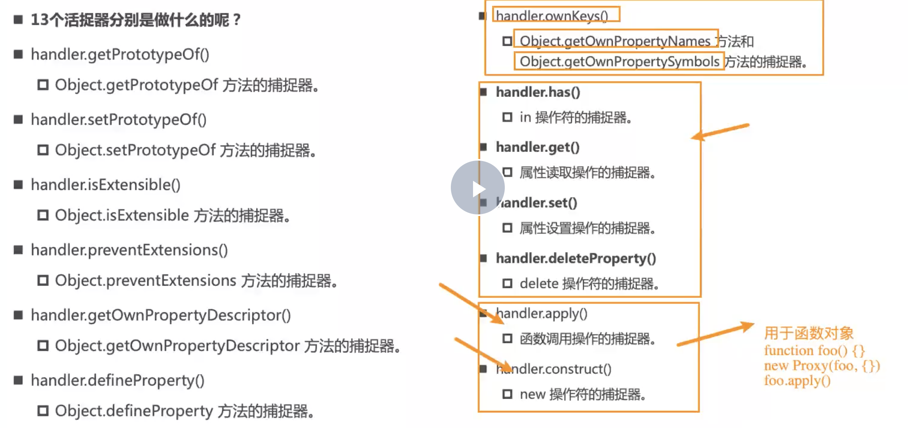

# 使用

```js

// 示例1：基本对象
 let obj = {
    name: 'bob',
    age: 20
}

const proxyObj = new Proxy(obj, {
    // 监听get捕获器
    get: function(targetObj, key, receiver){
        console.log(`${key}--被访问了`, targetObj);
        return targetObj[key]
    },
    // 监听set捕获器
    set: function(targetObj, key, newVal, receiver){
        targetObj[key] = newVal
        console.log(`${key}--被设置了`, targetObj);
    },
    // 监听in捕获器
    has: function(targetObj, key){
        console.log(`监听到${key}的in操作`, targetObj);
        return key in targetObj
    },
    // 监听delete捕获器
    deleteProperty: function(targetObj, key){
        console.log(`监听到${key}的delete操作`, targetObj);
        delete targetObj[key]
    },

})

console.log(name in proxyObj); // 触发has捕获器
console.log(delete proxyObj.name) // 触发delete捕获器

```

```js
// 示例2：函数对象监听
function foo(){}

const proxyFoo = new Proxy(foo, {
    // 监听函数apply操作：targetFoo是foo， thisArg是foo调用apply是传递的this对象， argArray是传给apply的参数
    apply: function (targetFoo,thisArg, argArray){
        console.log(`监听到foo函数的apply操作`);
        return targetFoo.apply(thisArg, argArray)
    },
    // 监听函数new操作: targetFoo是foo, arg是foo函数new的时候传递的参数，newTargetFoo相当于targetFoo
    construct: function (targetFoo, arg, newTargetFoo){
        console.log(`监听到foo函数的new操作`);
        return new targetFoo(arg)
    },
})

proxyFoo.apply({}, [11,22]) // 监听到foo函数的apply操作
new proxyFoo(55, 66) // 监听到foo函数的new操作
```

# 捕获器汇总




