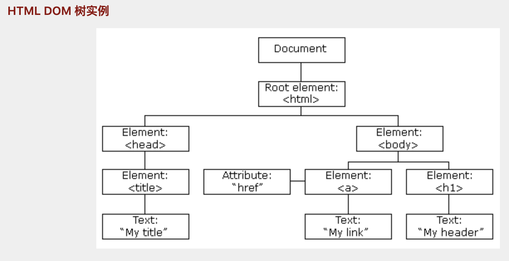

# 1. js分类
>w3c组织定义了一套标准；比如针对不同浏览器提供相同的api等
+ ECMASrcipt: 由ECMA组织定义js语法
+ BOM: 浏览器对象模型(比如：弹出新浏览器窗口、关闭移动浏览器以及调整浏览器窗口大小)
+ DOM: 文档对象模型`Document Object Model`(（一个html文本相当于一个文档;因为是对象模型；所以操作的都是对象；那么都是存储在内存中的;将整个页面划分成节点层级构成的文档

# 1.1 节点分类
> HTML 文档中的所有内容都是节点
+ 整个文档是一个文档节点
+ 每个 HTML 元素是元素节点
+ HTML 元素内的文本是文本节点
+ 每个 HTML 属性是属性节点
+ 注释是注释节点

```js
// 示例1：
<html>
   <head>
     <title>DOM Tutorial</title>
   </head>
   <body>
     <h1>DOM Lesson one</h1>
     <p>Hello world!</p>
   </body>
</html>
// 解析：
//1. <html> 节点没有父节点；它是根节点
//2. <head> 和 <body> 的父节点是 <html> 节点
//3. 文本节点 "Hello world!" 的父节点是 <p> 节点

//4. <html> 节点拥有两个子节点：<head> 和 <body>
//5. <head> 节点拥有一个子节点：<title> 节点
//6. <title> 节点也拥有一个子节点：文本节点 "DOM 教程"
//7. <h1> 和 <p> 节点是同胞节点，同时也是 <body> 的子节点

//8. <head> 元素是 <html> 元素的首个子节点
//9. <body> 元素是 <html> 元素的最后一个子节点
//10. <h1> 元素是 <body> 元素的首个子节点
//11. <p> 元素是 <body> 元素的最后一个子节点
```
# 2. dom获取元素
## 2.1 写在前面
+ 浏览器解析的顺序是从上往下；所以在script中访问元素时；元素必须已经声明过；否则返回根据获取元素的函数的不同，返回不同；一般我们会把script放在最后一个body之前。
```js
// 示例1
<body>
    <script>
        var main = document.getElementById("main");
        console.log(main);      //null
    </script>
    <div id="main">hello</div>
</body>
```
## 2.2 根据id获取
+ getElementById只能通过document调用
+ 对象的类型保存在属性`__proto__:HTMLDivElement`
```js
// 示例1：main的类型是HTMLDivElement
<body>
    <div id="main">hello</div>
    <script>
        var main = document.getElementById("main");
        console.log(main);      //main是一个对象
        console.dir(main);      //dir是打印对象
        //这里main对象
    </script>
</body>
```
## 2.3 根据标签组获取
+ getElementsByTagName可以容器对象调用
+ 注意getElementsByTagName获取到的集合是****动态集合：可以在执行的过程中动态添加****

```js
// 示例1：
<body>
    <div>hello</div>
    <div id="a">aaa</div>
    <div>hhhh</div>
    <script>
        var divs = document.getElementsByTagName("div");
        console.log(divs);          //HTMLCollection集合
        for (var i=0; i<divs.length; ++i){
            console.log(divs[i])    //打印出每个元素都是div对象；注意查看div对象的类型
        }
    </script>
</body>
```


```js
// 示例1
//动态集合
//script中都可以访问，因为都是全局作用域
<head>
    <meta charset="UTF-8">
    <title>Title</title>
    <script>
        var divs = document.getElementsByTagName("div");
        console.log(divs.length);  //0
    </script>
</head>
<body>
    <div>hello</div>
    <div id="a">aaa</div>
    <div>hhhh</div>
    <script>
        console.log(divs.length);  //3
    </script>
</body>
```
```js
//案例 :只获取container中的div标签
<body>
    <div id="container">
        <div id="a">aaa</div>
        <div>hhhh</div>
        <p>ppppp</p>
    </div>
    <script>
        var container = document.getElementById('container');
        var divs = container.getElementsByTagName('div');
        console.log(divs);
    </script>
</body>
```

## 2.4 通过name属性获取
+ getElementsByName
+ 不推荐使用；在不同浏览器下工作方式不同；比如在IE和Opera中获取name属性的为xxx的同时会把 id为xxx的也获取到

## 2.5 通过class获取元素
+ getElementsByClassName
+ getElementsByClassName 可以在任何元素上调用，不仅仅是document;调用这个方法的元素将作为本次查找的根元素.
+ 浏览器兼容问题；IE9以后才可以用


## 2.6 根据选择器获取
+ querySelector：只返回一个
+ 当class属性相同的时候；querySelector匹配到第一个class为a的返回
+ querySelector和querySelectorAll的区别就是querySelectorAll返回查找到的集合（可以返回多个）
+ pc浏览器从IE8开始才可以用；但是移动端可以用
```js
<body>
    <div id="container">
        <div id="a">aaa</div>
        <div class="a">hhhh</div>
        <div class="a">eeee</div>
        <p>ppppp</p>
    </div>
    <script>
        var element = document.querySelector('#a');
        var ele = document.querySelector('.a');
        console.log(ele);
    </script>
</body>
```
# 3. dom修改
+ 可以修改css样式
+ 可以修改元素内容/属性
+ 可以新增/删除元素
+ 可以修改事件
```js
// 示例1：
<body>
    <p id="p1">Hello World!</p>
    <script>
        // 修改p元素的内容为New text!
        document.getElementById("p1").innerHTML="New text!";
        // 修改p元素的样式颜色
        document.getElementById("p1").style.color="blue";
    </script>

</body>
```
```js
// 示例2:
// 解析：给div新增子节点p元素，并设置新p元素的id属性值为p3，内容节点的内容为“新内容”
<div id="d1">
<p id="p1">This is a paragraph.</p>
<p id="p2">This is another paragraph.</p>
</div>
<script>
    var pnode = document.createElement("p");
    var tnode = document.createTextNode("新内容");
    pnode.id = "p3";
    pnode.appendChild(tnode);
    var divNode = document.getElementById("d1");
    divNode.appendChild(pnode);
    var ps = divNode.getElementsByTagName("p");
    for (var i=0; i<ps.length; ++i){
        console.log(ps[i]);
    }
</script>
```


