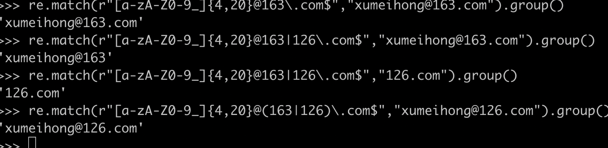

# 1 概述
## 1 新建正则表达式两种方式
+ 方式1：一种是使用`字面量`，以斜杠表示开始和结束(缺点：无法识别变量)
+ 方式2：一种是使用`RegExp构造函数`
    - RegExp构造函数还可以接受第二个参数，表示修饰符
+ 区别：字面量方式在引擎编译代码时，就会新建正则表达式，构造函数在运行时新建正则表达式，所以前者的效率较高
```js
// 示例1：
// 方式1：
var regex = /xyz/;

// 方式2：
var regex = new RegExp('xyz');
```

```js
// 示例1：
let hd = "hundunren"
/u/.test(hd)  //true   测试hd里面是否包含u
let a = 'u';
/a/.test(hd)  //false  无法取出a里面的变量，只能把a当做正则

// 示例2：

var regex = new RegExp(a, 'i');
regex.test(hd)  // true

```

```js
// 示例2：
var regex = new RegExp('xyz', 'i');
// 等价于
var regex = /xyz/i;
```
# 2 实例属性
## 2.0 模式
> 正则的默认匹配模式是区分大小写、匹配到就停止不再向后匹配、对每个输入行的从头开始逐个字符匹配
+ i: 忽略大小写
+ g：全局匹配
+ m：表示多行模式（multiline）；默认 ^和$ 匹配字符串的开始处和结尾处，加上m修饰符以后，^和$还会匹配行首和行尾，即^和$会识别换行符（\n）
```js
// 示例1：
/world$/.test('hello world\n') // false
/world$/m.test('hello world\n') // true
/^b/m.test('a\nb') // true
/a$/m.test('a\nb') // true
```
## 2.1 修饰符相关
+ 备注：以下属性都是只读的
+ RegExp.prototype.ignoreCase：返回一个布尔值，表示是否设置了i修饰符。
+ RegExp.prototype.global：返回一个布尔值，表示是否设置了g修饰符。
+ RegExp.prototype.multiline：返回一个布尔值，表示是否设置了m修饰符。
+ RegExp.prototype.flags：返回一个字符串，包含了已经设置的所有修饰符，按字母排序。
```js
// 示例1：
var r = /abc/igm;

r.ignoreCase // true
r.global // true
r.multiline // true
r.flags // 'gim'
```
## 2.2 与修饰符无关
+ RegExp.prototype.lastIndex：返回一个整数，表示下一次开始搜索的位置。该属性可读写，但是只在进行连续搜索时有意义。
    - （lastIndex属性只对同一个正则表达式有效）
    - 连续搜索时，搜索到默认没搜索reg返回null时，lastIndex则会被置0
+ RegExp.prototype.source：返回正则表达式的字符串形式（不包括反斜杠），该属性只读。

```js
// 示例1：
var r = /abc/igm;

r.lastIndex // 0
r.source // "abc"
```
# 3 实例方法
## 3.1 RegExp.prototype.test()
+ `RegExp.prototype.test()`: 返回一个布尔值，表示当前模式是否能匹配参数字符串
+ **注意**：
    - 如果正则表达式带有g修饰符，则每一次test方法都从上一次结束的位置开始向后匹配
    - 带有g修饰符时，可以通过正则对象的lastIndex属性指定开始搜索的位置
    - 带有g修饰符时，正则表达式内部会记住上一次的lastIndex属性，这时不应该更换所要匹配的字符串，否则会有一些难以察觉的错误（见示例4）
    - lastIndex属性只对同一个正则表达式有效
    - 如果正则模式是一个空字符串，则匹配所有字符串。（见示例5）
```js
// 示例1：
/cat/.test('cats and dogs') // true

// 示例2：
var r = /x/g;
var s = '_x_x';

r.lastIndex // 0
r.test(s) // true

r.lastIndex // 2
r.test(s) // true

r.lastIndex // 4
r.test(s) // false

// 示例3：
var r = /x/g;
var s = '_x_x';

r.lastIndex = 4;
r.test(s) // false

r.lastIndex // 0
r.test(s)

// 示例4：
var r = /bb/g;
r.test('bb') // true
r.test('-bb-') // false

// 示例5：
new RegExp('').test('abc')
// true
```

## 3.2 RegExp.prototype.exec()
+ **作用**: 用来返回匹配结果。如果发现匹配，就返回一个数组，成员是匹配成功的子字符串，否则返回null
+ **注意点**：如果正则表示式包含圆括号（即含有“组匹配”），则返回的数组会包括多个成员。第一个成员是整个匹配成功的结果，后面的成员就是圆括号对应的匹配成功的组。也就是说，第二个成员对应第一个括号，第三个成员对应第二个括号
```js
// 示例1：
var s = '_x_b_x';
var r = /_(x|y)_(a|b)_/;
console.dir(r.exec(s));     //["_x_b_", "x", "b"]

// 示例2：
var r = /a(b+)a/;
var arr = r.exec('_abbba_aba_');

arr // ["abbba", "bbb"]

arr.index // 1
arr.input // "_abbba_aba_"
```
+ **返回值**：exec方法的返回数组还包含以下两个属性：
    - input：整个原字符串。
    - index：整个模式匹配成功的开始位置（从0开始计数）。
+ **exec循环匹配**: 若要循环匹配必须加上g标识符
```js
// 示例1：这里会循环匹配是因为有标识符g
var reg = /a/g;
var str = 'ab_';
var r1 = reg.exec(str);
console.log(reg.lastIndex); // 1
console.log(r1.index);      // 0
var r2 = reg.exec(str);
console.log(reg.lastIndex); // 0
console.log(r2);            // null
var r3 = reg.exec(str);
console.log(reg.lastIndex); // 1
console.log(r3.index);      // 0
```

# 4 字符串的实例方法
+ 备注：以下4种字符串方法与正则有关
## 4.1 String.prototype.match()
+ `match`: 用于确定原字符串是否匹配某个子字符串，返回一个数组，成员为匹配的第一个字符串。如果没有找到匹配，则返回null【备注：匹配可用正则】
+ **注意点**：
    - 如果正则表达式带有g修饰符，则该方法与正则对象的exec方法行为不同，会一次性返回所有匹配成功的结果【exec：带g是返回第一次匹配到的，然后接着调接着匹配】
    - 设置正则表达式的lastIndex属性，对match方法无效，匹配总是从字符串的第一个字符开始
    - 返回的数组还有index属性和input属性，分别表示匹配字符串开始的位置和原始字符串
```js
// 示例1：
'cat, bat, sat, fat'.match('at') // ["at"]
'cat, bat, sat, fat'.match('xt') // null

// 示例2：
var s = '_x_x';
var r1 = /x/;
var r2 = /y/;

s.match(r1) // ["x"]
s.match(r2) // null


// 示例3：
var s = 'abba';
var r = /a/g;

s.match(r) // ["a", "a"]
r.exec(s) // ["a"]

// 示例4：
var matches = 'cat, bat, sat, fat'.match('at');
matches.index // 1
matches.input // "cat, bat, sat, fat"
```
## 4.2 String.prototype.search()
+ String.prototype.search()：按照给定的正则表达式进行搜索，返回一个整数，表示匹配开始的位置。
## 4.3 String.prototype.replace()
+ 备注：replace的执行，是匹配到一个就替换一个
+ `replace`定义: 替换匹配到的值；接受两个参数，一个是正则，一个是替换的内容,返回替换后的字符串。
```js
// 示例1：
'aaa'.replace('a', 'b') // "baa"
'aaa'.replace(/a/, 'b') // "baa"
'aaa'.replace(/a/g, 'b') // "bbb"

// 示例2：消除空格
var str = '  #id div.class  ';
str.replace(/^\s+|\s+$/g, '')   // "#id div.class"

// 示例3：不加替换时，默认使用undefined进行替换
var str = '  #id div.class  ';
str.replace(/^\s+|\s+$/)    // "undefined#id div.class  "
```

+ replace方法的第二个参数可以使用美元符号$，用来指代所替换的内容
```js
$&：匹配的子字符串。
$`：匹配结果前面的文本。
$'：匹配结果后面的文本。
$n：匹配成功的第n组内容，n是从1开始的自然数。
$$：指代美元符号$。
```
```js
// 示例1：
'hello world'.replace(/(\w+)\s(\w+)/, '$2 $1')  // "world hello"
'abc'.replace('b', '[$`-$&-$\']')   // "a[a-b-c]c"
```
+ replace方法的第二个参数可以是替换函数，替换函数可以接受多个参数
    - 替换函数的第一个参数是捕捉到的内容，第二个参数是捕捉到的组匹配
```js
// 示例1：
'3 and 5'.replace(/[0-9]+/g, function (match) {
  return 2 * match;
})      // "6 and 10"

// 示例2：
var template = '<span id="p1"></span>'
  + '<span id="p2"></span>'
  + '<span id="p3"></span>';

template.replace(
  /(<span id=")(.*?)(">)(<\/span>)/g,
  function(match, $1, $2, $3, $4){
    return $1 + $2 + $3 + prices[$2] + $4;
  }
);
```
## 4.4 String.prototype.split()
+ String.prototype.split()：按照给定规则进行字符串分割，返回一个数组，包含分割后的各个成员。

# 5 匹配规则
## 5.1 基本规则
+ **特别注意**：如果使用RegExp方法生成正则对象，转义需要使用两个斜杠，因为字符串内部会先转义一次
```js
// 示例1：
/1\+1/.test('1+1')  // true

(new RegExp('1\+1')).test('1+1')    // false

(new RegExp('1\\+1')).test('1+1')   // true
```
+ 关于 | 和 () 理解
    - `| `:表示 `或`匹配左边或者右边，但会将整个表达式划分为两部分左和右，匹配到左边就不会再匹配右边了；所以需要和`()`搭配



+ . 理解
  - 点字符（.）匹配除回车（\r）、换行(\n) 、行分隔符（\u2028）和段分隔符（\u2029）以外的所有字符
+ ^ 理解
    - [^abc]： 表示除了a、b、c、这3个字符以外的其他字符都匹配
    - [^]： 表示匹配一切字符，其中包括换行符（. 点是不匹配换行空格制表等）
```js
// 示例1：
/[^abc]/.test('bbc news') // true
/[^abc]/.exec('bbcnaws')    // 匹配到 n
/[^abc]/.test('bbc') // false
```
+ 预定义模式指的是某些常见模式的简写方式。
```js
\d 匹配0-9之间的任一数字，相当于[0-9]。
\D 匹配所有0-9以外的字符，相当于[^0-9]。
\w 匹配任意的字母、数字和下划线，相当于[A-Za-z0-9_]。
\W 除所有字母、数字和下划线以外的字符，相当于[^A-Za-z0-9_]。
\s 匹配空格（包括换行符、制表符、空格符等），相等于[ \t\r\n\v\f]。
\S 匹配非空格的字符，相当于[^ \t\r\n\v\f]。
\b 匹配词的边界。
\B 匹配非词边界，即在词的内部。
```

## 5.2 贪婪模式和非贪婪模式
+ 贪婪模式：一般默认的匹配就是贪婪匹配，尽可能多的匹配（示例1）
+ 非贪婪模式：在`量词符(? + *)`后加上`？`,会将贪婪模式改为非贪婪模式；只要匹配到一个满足条件就不在进行后续匹配
    - `+?`：表示某个模式出现1次或多次，匹配时采用非贪婪模式。
    - `*?`：表示某个模式出现0次或多次，匹配时采用非贪婪模式。
    - `??`：表格某个模式出现0次或1次，匹配时采用非贪婪模式。
```js
// 示例1：贪婪模式
// 解析：a+ 表示匹配a 1次或者多次，默认贪婪所以选择多次
var s = 'aaa';
s.match(/a+/) // ["aaa"]

// 示例2：非贪婪模式
var s = 'aaa';
s.match(/a+?/) // ["a"]
```

## 5.3 修饰符


## 5.4 重复匹配{}
+ {n}: 表示恰好重复n次
+ {n,}: 表示至少重复n次，
+ {n,m}: 表示重复 [n, m]闭区间的所有整数取值
```js
// 示例1:
/lo{1,3}k/.test('loook') // true
/lo{2}k/.test('look') // true
/lo{2,5}k/.test('looook') // true
```

## 5.5 组匹配()
+ (): 默认是针对单个字符匹配的，括号可以将括号内的内容看做一个整体进行匹配
```js
// 示例1：
/fred+/.test('fredd') // true
/(fred)+/.test('fredfred') // true 此时匹配的是fred这个单词出现一次或者多次

// 示例2：
/(.)b(.)/.exec('abcabc'); 
//["abc", "a", "c", index: 0, input: "abcabc", groups: undefined]
```

+ \n：正则表达式内部，还可以用`\n`引用括号匹配的内容，`n`是从1开始的自然数，表示对应顺序的括号中匹配的内容
```js
// 示例1：\1表示第一个括号匹配的内容（即a），\2表示第二个括号匹配的内容（即c）。
/(.)b(.)\1b\2/.test("abcabc")   // true

// 示例2：嵌套匹配 \1指向外层括号，\2指向内层括号
/y((..)\2)\1/.test('yabababab') // true


// 示例3：
var tagName = /<([^>]+)>[^<]*<\/\1>/;
tagName.exec("<b>bold</b>") // ["<b>bold</b>", "b", index: 0, input: "<b>bold</b>", groups: undefined]
```
+ (?:x): 称为非捕获组（Non-capturing group）
    - (?:x)和(x): 正则是等价的，只是非捕获组不会返回括号内容
```js
// 示例1:
// 解析：假定需要匹配foo或者foofoo，正则表达式就应该写成/(foo){1, 2}/，但是这样会占用一个组匹配。这时，就可以使用非捕获组，将正则表达式改为/(?:foo){1, 2}/，它的作用与前一个正则是一样的，但是不会单独输出括号内部的内容
var m = 'abc'.match(/(?:.)b(.)/);
m // ["abc", "c"]
```

```js
// 示例2：
// 正常匹配
var url = /(http|ftp):\/\/([^/\r\n]+)(\/[^\r\n]*)?/;

url.exec('http://google.com/');
// ["http://google.com/", "http", "google.com", "/"]

// 非捕获组匹配
var url = /(?:http|ftp):\/\/([^/\r\n]+)(\/[^\r\n]*)?/;

url.exec('http://google.com/');
// ["http://google.com/", "google.com", "/"]
```

+ `x(?=y)`: 称为先行断言（Positive look-ahead）
    - x只有在y前面才匹配，y不会被计入返回结果。
    - 先行断言”中，括号里的部分是不会返回的
```js
// 示例1: b在c前面所以被匹配，但是括号对应的c不会被返回。
var m = 'abc'.match(/b(?=c)/);
m // ["b"]
```

+ x(?!y): 称为先行否定断言（Negative look-ahead）
    - x只有不在y前面才匹配，y不会被计入返回结果
    - “先行否定断言”中，括号里的部分是不会返回的
```js
// 示例1：
/\d+(?!\.)/.exec('3.14')
// ["14"]

// 示例2：
var m = 'abd'.match(/b(?!c)/);
m // ['b']
```