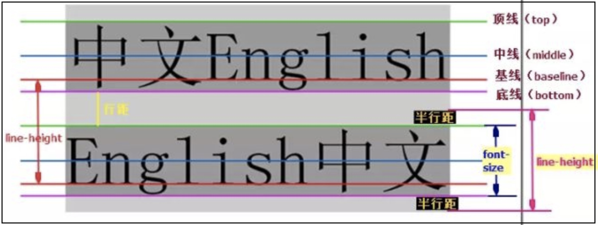

# css文本
## 1. 字体
+ `font-size`：大小
+ `font-family`：字体
  - 有时候电脑不支持字体是汉字，可以写汉字的unicode码
+ `font-weight`：字体粗细
  - 提倡用数字表示
  - normal：正常等价400
  - bold：加粗等价700
  - bolder：比粗还粗
  - lighter：较细
+ `font-style`：字体风格
    - normal：正常
    - italic：斜体
    - oblique：倾斜
+ font：
    - **备注**：font必须包含`font-size 和 font-family`
    - `font：font-style font-weight font-size/line-height font-family`
```css
/* 示例1 */
<style>
    h1 {
        font-size: 40px;
        font-family: "microsoft yahei","宋体";
        color: chocolate;
    }
</style>
```
## 2. 行高
+ `line-height`：行高取值如下（推荐使用数字无单位）
    - normal：正常
    - 数字：2.5
    - 长度：3em
    - 百分比：34%
    - px：18px


## 3. 文本装饰
+ `text-decoration`：通常用于给链接修改装饰效果

值| 描述
---|---
none | 默认不加修饰
underline | 定义文本下划线
overline | 定义文本上划线
line-through | 定义文本删除线