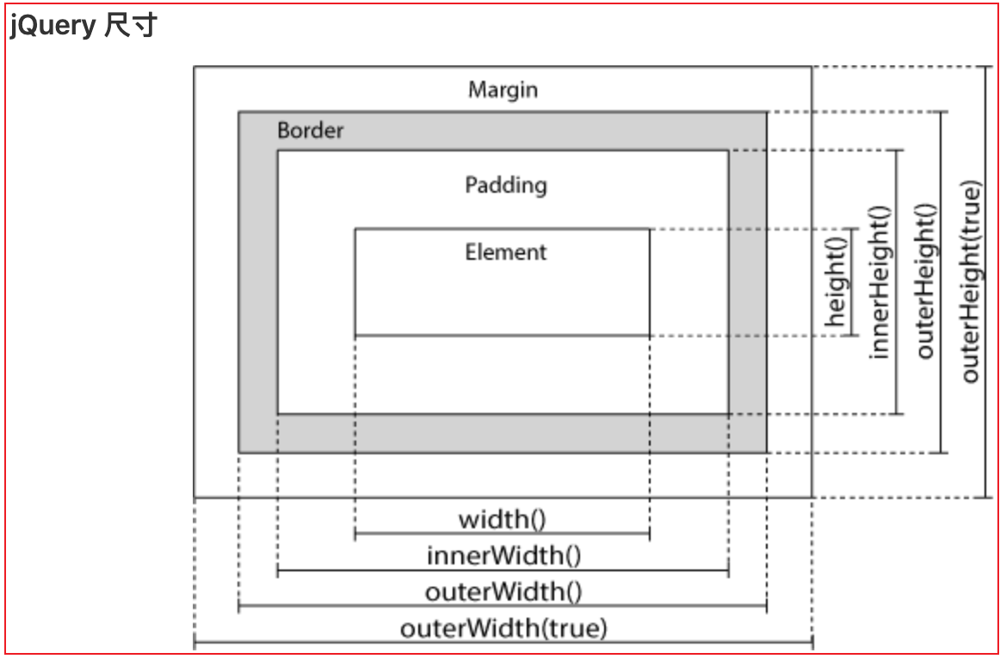

# 1. jquery 介绍

## 1.0 jquery 语法

- 基本语法\$(selector).action()
  - 美元符号定义 jQuery
  - 选择符（selector）"查询"和"查找" HTML 元素
  - jQuery 的 action() 执行对元素的操作

## 1.1 jquery 顶级对象

- DOM 中的顶级对象：`document`页面的顶级对象
- BOM 中的顶级对象：`window`浏览器的顶级对象
- jQuery 的顶级对象：`jQuery（可以使用 $ 代替）`;因为`$`更简单

## 1.2 页面加载事件对比

```js
// 示例1：DOM中页面加载事件
window.onload = function() {
  console.log("window.onload加载事件1");
};
window.onload = function() {
  console.log("window.onload加载事件2");
};

// 示例2：jquery中window页面加载，
// 这种形式和DOM的load加载完全相同——需要等待页面的所有标签和外部资源css、js、图片等下载完毕

$(window).load(function() {
  console.log("$(window).load(function(){})——1");
});
$(window).load(function() {
  console.log("$(window).load(function(){})——2");
});
// 示例3：页面中的基本标签加载后执行
$(document).ready(function() {
  console.log("$(document).ready(function (){})");
});
// 示例4：等同于示例3 页面中的基本标签加载后执行
jQuery(function() {
  console.log("jQuery(function(){})");
});
// 示例5：等同于示例3和4 页面中的基本标签加载后执行
$(function() {
  console.log("jQuery(function(){})");
});
```

# 2. jquery 和 dom 对象互转

- 有时候需要 dom 和 jquery 对象互转(有些兼容性 jquery 没有封装)
- dom 转 jquery：只需要把 dom 对象放在 `$(dom对象)` 中就变成了 jquery 对象
- jquery 转 dom：有两种方式
  - \$(btn).get(0) ——> 转成 dom 对象了
  - \$(btn)[0] ——> 转成 dom 对象了

```js
// 示例1：dom转jquery
    <input type="button" id="btn" value="点我">
    <script>
        // dom 方式修改按钮背景颜色
        var btn = document.getElementById('btn');
        btn.onclick = function (){
            this.style.backgroundColor = "red";
        }
        // jquery方式 修改按钮背景颜色
        $(btn).click(function(){
            $(this).css('backgroundColor','pink');
        })

    </script>
```

```js
// 示例2：jquery转dom对象
// 方法1：btnObj1 = $(btn).get(0)
var btnObj1 = $(btn).get(0);
btnObj1.onclick = function() {
  this.style.backgroundColor = "red";
};

// 方法2：btnObj2 = $(btn)[0]
var btnObj2 = $(btn)[0];
btnObj2.onclick = function() {
  this.style.backgroundColor = "red";
};
```

# 3. jquery 选择器&常用方法

## 3.1 选择器

- `$("#id")`：根据 id 选择器获取元素
- `$(".class")`：根据类选择器获取元素
- `$("标签名字")`：根据标签名获取元素；返回多个
- `$("*")`：获取所有的元素
- \$("li.cls")：元素+类选择器
- `$(span,p,div)`：多条件选择器

## 3.2 常用方法(基本都是类比DOM)
+ 获取内容：
  - html()：设置标签中间显示其他标签或者内容；相当于 innerHTML
  - text("设置内容")：设置标签中间显示的文本内容；相当于 dom 中的 innerText 或者 textContent
  - val()：获取或者设置标签内的 value 值（无参数为获取，有参数为设置）
+ 获取属性：
  - attr()用于获取或者设置属性值
  - `attr("href")`比如这里获取 href 的值
  - `attr("href", "www.baidu.com")`比如这里设置 href 的值
  - `attr({
    "href" : "//www.w3cschool.cn/jquery",
    "title" : "jQuery 教程"
    })`
+ 添加元素：
    - append() - 在被选元素内部的结尾插入指定内容
    - prepend() - 在被选元素内部的开头插入指定内容（见示例1）
        - 如果只是单一元素则是在元素的内容前继续插入内容，还是保持一个元素
        - 如果父子元素，则是在第一个子元素前插入一个子元素；
    - after() - 在被选元素之后插入内容
    - before() - 在被选元素之前插入内容
+ 删除元素：
  - $("#div1").remove()：删除被选元素及其子元素
  - $("p").remove(".italic")：只删除class=italic的p元素
  - $("#div1").empty()：删除被选元素的子元素
+ css()：设置样式
    - 获取css属性值(传入一个参数)：`$("p").css("background-color");`
    - 设置css样式值：`$("p").css({"background-color":"yellow","font-size":"200%"});`
+ 尺寸
    - width()
    - height()
    - innerWidth()
    - innerHeight()
    - outerWidth()
    - outerHeight()

```js
// 示例1：添加元素prepend()
<head>
    <meta charset="UTF-8" />
    <title>Document</title>
    <script src="https://libs.baidu.com/jquery/1.11.3/jquery.min.js"></script>
    <script>
      $(document).ready(function() {
        $("#btn1").click(function() {
          $("p").prepend("<b>在开头追加文本</b>。 ");
        });
        $("#btn2").click(function() {
          $("ol").prepend("<li>在开头添加列表项</li>");
        });
      });
    </script>
  </head>
  <body>
    <p>这是一个段落。</p>
    <p>这是另外一个段落。</p>
    <ol>
      <li>List item 1</li>
      <li>List item 2</li>
      <li>List item 3</li>
    </ol>
    <button id="btn1">添加文本</button>
    <button id="btn2">添加列表项</button>
  </body>
```
```js
// 示例2：设置尺寸
<script>
$(document).ready(function(){
  $("button").click(function(){
    var txt="";
    txt+="Width of div: " + $("#div1").width() + "</br>";
    txt+="Height of div: " + $("#div1").height();
    $("#div1").html(txt);
  });
});
</script>
</head>
<body>

<div id="div1" style="height:100px;width:300px;padding:10px;margin:3px;border:1px solid blue;background-color:lightblue;"></div>
<br>
<button>显示 div 元素的尺寸</button>
<p>width() - 返回元素的宽度</p>
<p>height() - 返回元素的高度</p>
```