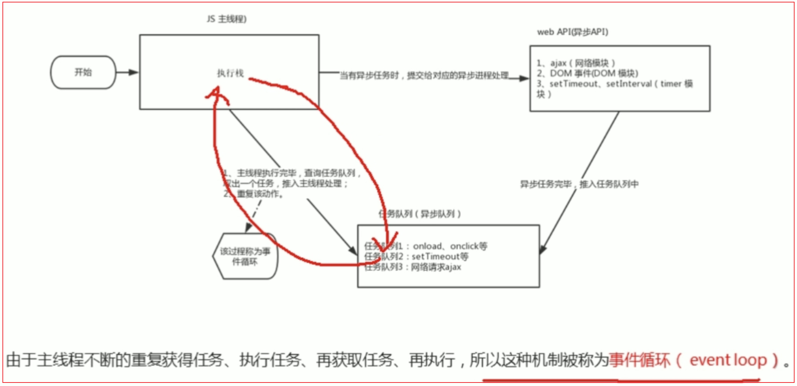

# 1 异步任务

- 异步任务通过回调函数实现的；一般有如下 3 种：
  - 普通事件：click 等
  - 资源加载：load 等
  - 定时器：setInterval，setTimeout
```js
// 示例1：打印顺序：1 3 2
setTimeout(function(){
    console.log(2);
},3000);
console.log(1);
console.log(3);

// 示例2：
// 打印顺序：1 3 4 2 或者 1 3 2 4
// 解析：主线程会把点击事件和定时器交给异步线程，然后继续执行打印1和3；此时如果在3秒内点击了box，则会先打印出4，再打印2，否则打印2，会不会打印4，需要看点击事件是否会被触发
var box = document.getElementById("box");
box.onclick = function() {
console.log(4);
};

setTimeout(function() {
console.log(2);
}, 3000);

console.log(1);
console.log(3);
```

# 2 事件循环机制
+ 执行步骤: 主线程会执行同步任务，碰到异步任务，主线程会提交给异步线程，异步线程处理异步任务，如果异步任务处理就绪，异步线程会将异步任务放入事件队列中；此时当主线程的执行栈中没有栈帧时，主线程就会查看事件队列，将事件队列中的任务添加到栈中执行。

问题1：
+ 事件队列中很多就绪任务，获取顺序
+ 是主线程中没有任务任务才去队列中获取吗？


